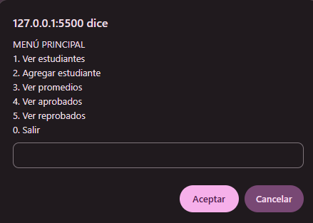
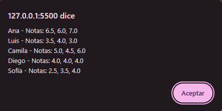
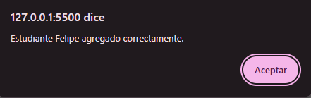
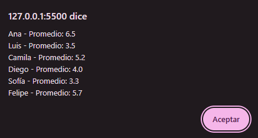
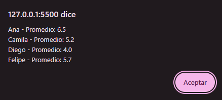
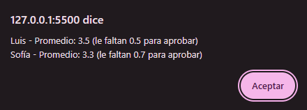

# Gestión de estudiantes y notas en JavaScript

Aplicación sencilla en JavaScript que se ejecuta en el navegador y permite gestionar una lista de estudiantes con sus notas, calcular promedios y determinar quiénes aprueban y quiénes reprueban. Fue desarrollada como proyecto del **Módulo 3: Fundamentos de programación en JavaScript** de un curso Trainee de Front End.

El objetivo es demostrar el uso de los fundamentos del lenguaje: variables, condicionales, ciclos, funciones, arreglos y objetos.

Demo en vivo: 

## Contenido

- [Funcionalidades](#funcionalidades)
- [Tecnologías](#tecnologías)
- [Cómo ejecutarlo](#cómo-ejecutarlo)
- [Cómo usarlo](#cómo-usarlo)
- [Capturas de pantalla](#capturas-de-pantalla)
- [Estructura del proyecto](#estructura-del-proyecto)
- [Conceptos aplicados](#conceptos-aplicados)
- [Decisiones de diseño](#decisiones-de-diseño)

## Funcionalidades

- **Ver estudiantes:** muestra cada estudiante con sus notas.
- **Agregar estudiante:** pide el nombre, la cantidad de notas y cada nota.
- **Ver promedios:** calcula el promedio de cada estudiante.
- **Ver aprobados:** lista los estudiantes cuyo promedio es 4 o más.
- **Ver reprobados:** lista los demás estudiantes e indica cuántos puntos les faltan para aprobar.

**Reglas**

- Las notas van de 1 a 7 y se aprueba con un promedio de 4 o más.
- El promedio se redondea a un decimal, de modo que el valor que se muestra coincide con el que define el estado.
- Estos valores se pueden modificar en las constantes del inicio de `app.js`.

**Validaciones**

- Los números y las notas se vuelven a pedir hasta que sean válidos.
- La cantidad de notas debe ser un número entero entre 1 y 10.
- No se aceptan textos vacíos ni opciones de menú inexistentes.
- Si se cancela un `prompt`, la acción se detiene sin errores y no se guarda un estudiante incompleto.

## Tecnologías

- JavaScript (ES6+)
- HTML básico

No requiere instalar dependencias ni Node.js.

## Cómo ejecutarlo

El programa usa `prompt()` y `alert()`, que solo existen en el navegador, por lo que **no funciona con Node**.

1. Abre la carpeta en VS Code.
2. Abre `index.html` con la extensión [Live Server]

## Cómo usarlo

La página muestra un botón por cada función, además de un botón para iniciar el menú completo:

| Botón | Qué hace |
|---|---|
| Iniciar menú | Abre el menú completo con todas las opciones |
| Ver estudiantes | Muestra todos los estudiantes con sus notas |
| Agregar estudiante | Pide nombre y notas, y lo agrega a la lista |
| Ver promedios | Muestra el promedio de cada estudiante |
| Ver aprobados | Muestra los estudiantes con promedio de 4 o más |
| Ver reprobados | Muestra los demás y los puntos que les faltan para aprobar |

Los resultados se muestran en una ventana emergente y en la consola del navegador.

La lista inicia con cinco estudiantes de ejemplo (Ana, Luis, Camila, Diego y Sofía), con tres notas cada uno.

## Capturas de pantalla


### Página inicial


### Menú principal



### Ver estudiantes



### Agregar un estudiante



### Promedios



### Aprobados



### Reprobados



### Validación de entradas


## Estructura del proyecto

```
proyecto-consola/
├── index.html          # Página básica con botones
├── app.js              # Lógica de la aplicación
├── README.md           # Este archivo
├── documentacion.docx  # Explicación del código y decisiones
└── capturas/           # Capturas de pantalla de la aplicación
```

## Conceptos aplicados

| Concepto | Dónde se usa |
|---|---|
| `let` / `const` | Todo el código (no se usa `var`) |
| Funciones | Operaciones, validaciones, acciones y menú |
| Operaciones matemáticas | `sumar`, `restar` y `dividir`, usadas en el cálculo de promedios |
| `if` / `else` / `switch` | Validaciones y menú |
| `for` / `while` | Promedio, filtrado, ingreso de notas, validaciones y menú principal |
| Arreglos | Lista `estudiantes` y arreglo `notas` de cada estudiante |
| Objetos y métodos | `crearEstudiante()` con `promedio()`, `estaAprobado()`, `describir()` y `describirPromedio()` |
| `map` / `forEach` | Armado y visualización de las listas |
| Validaciones | `pedirNumero()`, `pedirTexto()`, `pedirNota()` y `pedirCantidadNotas()` |

## Decisiones de diseño

- **Una sola aplicación con un hilo conductor:** las operaciones matemáticas (`sumar`, `restar`, `dividir`) se usan dentro del cálculo de promedios y de los puntos que faltan para aprobar, en lugar de una calculadora aparte.
- **`index.html` con botones:** `prompt()` y `alert()` necesitan un navegador, así que se usa una página mínima que carga el script. Los botones permiten iniciar el programa cuando el usuario quiere y probar cada función por separado. La lógica se mantiene en `app.js`.
- **El estado se calcula, no se guarda:** aprobado o reprobado se obtiene a partir del promedio cada vez que se consulta, por lo que siempre está actualizado.
- **Funciones pequeñas de una sola responsabilidad:** facilitan leer, probar y reutilizar el código.
- **Uso de `null`:** se devuelve al cancelar un `prompt` y al dividir por cero, para manejar estos casos sin lanzar errores.
- **Modo estricto (`"use strict"`):** hace visibles errores como usar una variable sin declarar.

El detalle completo está en la documentación.


## Autoría

Proyecto académico del Módulo 3, desarrollado por Felipe Muñoz Zamora.
